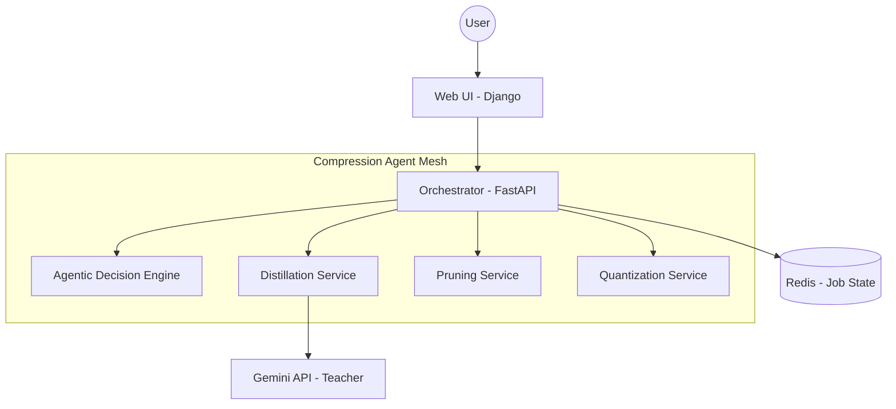

# 🚀 Agentic Model Compression System

An intelligent, multi-stage framework for LLM compression governed by an AI Agent. This system automatically analyzes, optimizes, and evaluates large language models using Distillation, Pruning, and Quantization.

---

## 🏗️ System Architecture

The system follows a **Microservices Architecture** where each compression technique and management component is isolated. This ensures scalability and allows for independent optimization of each stage.



---

## 🧩 Microservices Definition

| Service | Technology | Description |
| :--- | :--- | :--- |
| **Web UI** | Django | Provides the dashboard, visualization graph, and job management interface. |
| **Orchestrator** | FastAPI | The "Brain" of the system. Manages the job lifecycle, interacts with Redis, and routes tasks to the specific compression services. |
| **Distillation** | FastAPI / PyTorch | Performs Knowledge Distillation by generating synthetic datasets via the Gemini API. |
| **Pruning** | FastAPI / PyTorch | Implements structured/unstructured weight pruning to reduce model sparsity. |
| **Quantization** | FastAPI / PyTorch | Converts model weights from FP32/FP16 to INT8/INT4 precision. |
| **Redis** | Redis DB | Stores real-time job status, logs, and "learned" optimization paths. |

---

## 🛠️ Compression Methodologies

### 1. Knowledge Distillation
*   **Method:** Response-based distillation.
*   **Process:** The system uses a high-performance "Teacher" model (Gemini) to generate high-quality responses for a synthetic dataset. A smaller "Student" model is then fine-tuned on these responses.
*   **Why:** Best for maintaining complex reasoning and linguistic quality while drastically reducing the number of parameters.

### 2. Weight Pruning
*   **Method:** Magnitude-based pruning.
*   **Process:** The system identifies and removes "unimportant" neurons (weights close to zero) that contribute least to the model's output.
*   **Why:** Ideal for reducing the model's physical footprint and potentially speeding up inference on hardware that supports sparse operations.

### 3. Quantization
*   **Method:** Post-Training Quantization (PTQ).
*   **Process:** Weights are converted from high-precision floating-point (32-bit) to lower-precision integers (8-bit).
*   **Why:** The most effective method for reducing RAM/VRAM usage and increasing throughput with minimal impact on accuracy.

---

## 🚀 Getting Started (Local Setup)

Follow these steps to run the full stack on your local machine.

### 1. Prerequisites
*   **Docker & Docker Compose** (Highly Recommended)
*   **Python 3.10+** (For local development)
*   **Gemini API Key** (Get one from [Google AI Studio](https://aistudio.google.com/))

### 2. Clone the Repository
```bash
git clone https://github.com/shash0609-eng/Agentic-AI-model_compression.git
cd Agentic-AI-model_compression
```

### 3. Environment Configuration
Create a `.env` file in the root directory and add your API key:
```env
GEMINI_API_KEY=your_actual_key_here
```

### 4. Run with Docker Compose
The simplest way to start all services is using the pre-configured compose file:
```bash
docker-compose up --build -d
```
*Wait for the containers to build and start. The orchestrator will download necessary base dependencies on the first run.*

### 5. Access the Web App
Open your browser and navigate to:
*   **Dashboard:** [http://localhost:8003](http://localhost:8003)
*   **Orchestrator API Docs:** [http://localhost:8000/docs](http://localhost:8000/docs)

### 6. Running your first Job
1.  Go to the **"Compress Model"** page.
2.  Enter a HuggingFace model ID (e.g., `gpt2` or `Qwen/Qwen2-7B-Instruct`).
3.  Click **"START COMPRESSION AGENT"**.
4.  Switch to the **"Analyze"** tab to see the real-time traversal graph.

---

## 🔄 The Feedback Loop
If the compressed model does not meet the **Target Accuracy** defined in `common/config.py`, the Agent will automatically attempt a second iteration using a different combination of techniques (e.g., if Distillation wasn't enough, it may add Quantization).

---

## 🧹 Maintenance
To clear all job history and reset the system:
*   Click the **"Reset All"** button in the Jobs dashboard.
*   Or run: `docker-compose restart` to clear in-memory logs.
